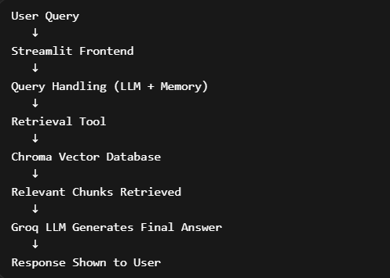
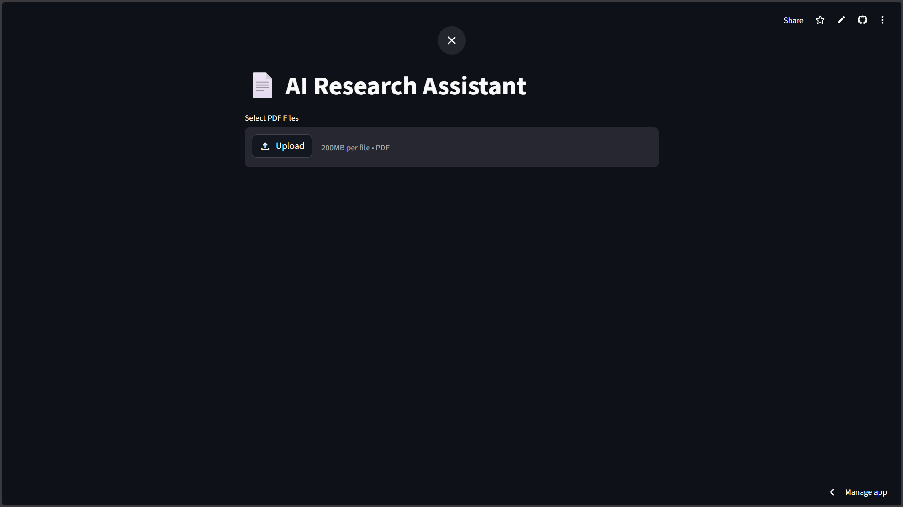
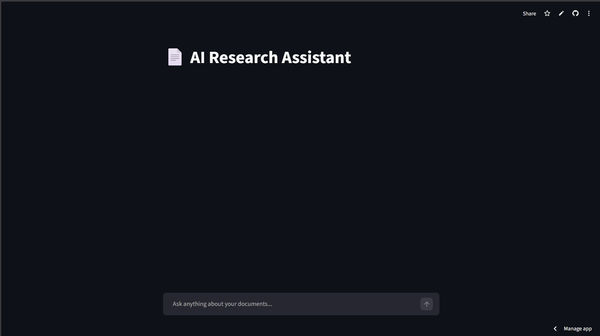
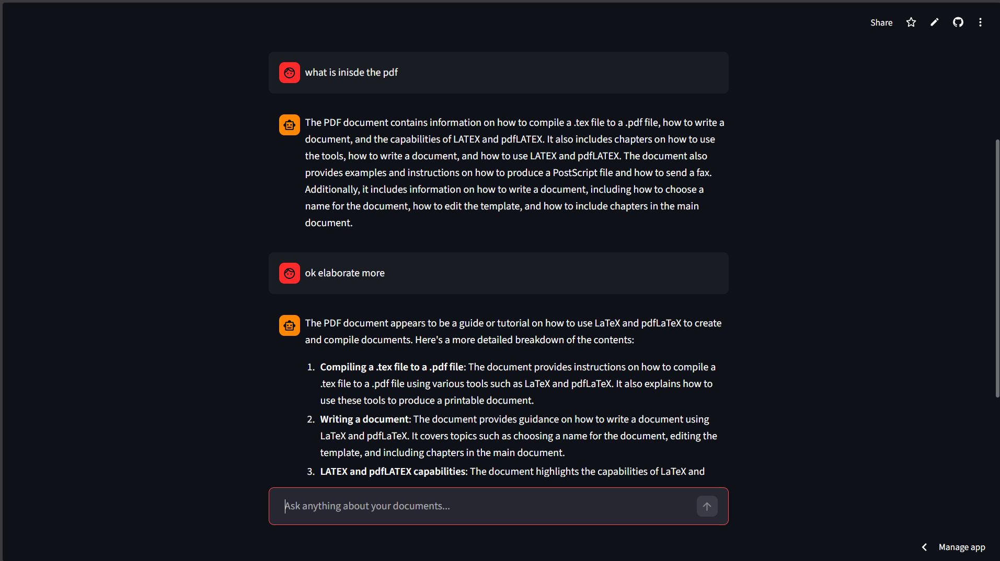

<p align="center">
  
</p>

<h1 align="center">🧠 AI Research Assistant</h1>

<p align="center">
  🚀 A RAG-based GenAI system with semantic search, memory, and chat UI
</p>

<p align="center">
  
  
  
  
  
</p>

---

## 🔥 Overview

AI Research Assistant is a **Retrieval-Augmented Generation (RAG)** system that:

- 📄 Understands documents (PDFs)
- 🔍 Retrieves relevant context using embeddings
- 🤖 Generates accurate answers using LLM
- 💬 Supports follow-up questions (memory-aware)
- ⚡ Uses Groq for ultra-fast responses

---

## 🧠 Why This Project Stands Out

Most AI chatbot projects:

- ❌ Hallucinate answers  
- ❌ Ignore document grounding  
- ❌ Lack system design  

This project solves that using:

- ✔ Retrieval-Augmented Generation (RAG)
- ✔ Context-grounded responses
- ✔ Memory-aware query handling
- ✔ Modular pipeline design  

👉 Built to simulate **real-world GenAI systems**, not toy demos.

---

## ⚙️ How It Works

1. Documents are loaded and split into chunks  
2. Chunks are converted into embeddings  
3. Stored inside Chroma vector database  
4. User query is matched with relevant chunks  
5. LLM generates answer using retrieved context  

👉 Ensures answers are **accurate, grounded, and explainable**

---

## 🧠 Architecture

<p align="center">
  
</p>

---
User Query
↓
Query Enhancement (Memory)
↓
Vector Search (Chroma)
↓
Top-K Chunks
↓
LLM (Groq)
↓
Final Answer


## 🎯 Features

- ✅ Retrieval-Augmented Generation (RAG)
- ✅ Semantic Search using Embeddings
- ✅ Conversational Memory
- ✅ Streamlit Chat UI
- ✅ Multi-document support
- ✅ Fast inference via Groq

---

## 🖥️ Demo UI

### 🔹 Chat Interface

<p align="center">
  
</p>

---

### 🔹 Asking a Question

<p align="center">
  
</p>

---

### 🔹 AI Response

<p align="center">
  
</p>

## 🛠️ Tech Stack

| Layer        | Technology |
|-------------|----------|
| LLM         | Groq (LLaMA 3.3) |
| Retrieval   | Chroma DB |
| Embeddings  | HuggingFace |
| Framework   | LangChain |
| UI          | Streamlit |
| Language    | Python |

---

## 📂 Project Structure

apps/
│
├── data_ingestion.py
├── data_retrieval.py
├── query_handling.py
│
├── vectorstore/
├── Data/
└── requirements.txt


---

## ⚙️ Setup

```bash
git clone https://github.com/your-username/ai-research-assistant.git
cd ai-research-assistant